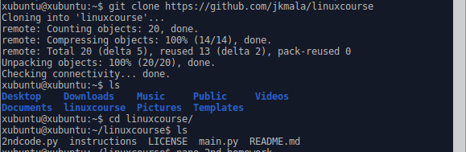
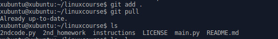
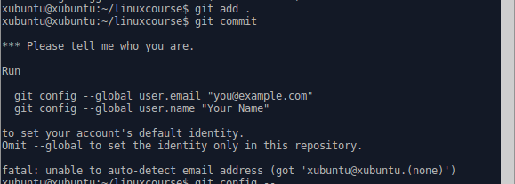
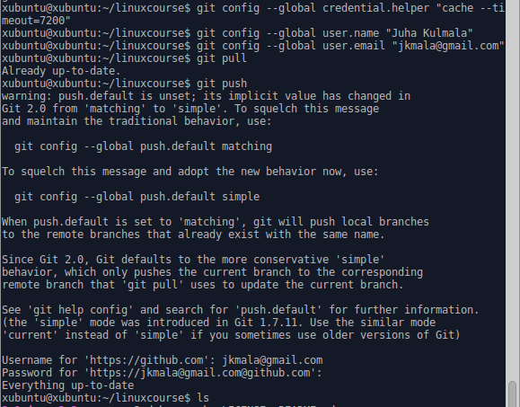
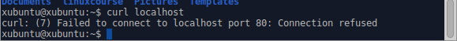
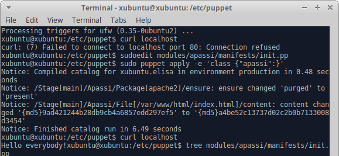

# 2. läksy - asenna palvelin Puppetilla

## Alkutoimet

Kotitehtävän ohjeistus löytyi [kurssisivulta](http://terokarvinen.com/2017/aikataulu-%E2%80%93-linuxin-keskitetty-hallinta-%E2%80%93-ict4tn011-11-%E2%80%93-loppukevat-2017-p2#comment-22372), jota opettaja Tero Karvinen ylläpitää. 

Aloitin kotitehtäväni kannettavalla tietokoneella, johon käytin Live-USB tikkua, jossa oli Xubuntu 16.01 käyttöjärjestelmä.

Ensimmäiset komentoni olivat:
> $ setxkbmap fi

> $ sudo apt-get update

> $ sudo apt-get -y install git

Näillä siis vaihdon itselle suomalaisen näppämistöasettelun. Ja latasin asensin Git-ohjelman jota käytetään myös tämön kotitehtävän raportoimiseen. Olimme jo oppitunnilla tutustuneet Git-ohjelmaan ja olin perustanut GitHub.com tilin, jossa minulla oli jo linuxcourse -niminen projekti. Tähän kansioon aion kerätä tämän kurssin kotitehtävät. Seuraavalla komennolla otin käyttöön kyseisen projektin kansion GitHubista:
> $ git clone https://github.com/jkmala/linuxcourse

Asensin myös Gedit editorin, koska se vaikutti mukavammalta kuin Nano.
> $ sudo apt-get install -y gedit

Siirryin linuxcourse -kansioon ja aloitin tämän läksyn kirjoittamisen komennolla:
> $ gedit 2nd_homework

Avasin itselleni myös oppaan miten kirjoittaa markdownia sivulta:
[https://guides.github.com/features/mastering-markdown/](https://guides.github.com/features/mastering-markdown/)

Kirjoittelin tätä alkua tässä geditillä, mutta ajattelin kokeilla tallennusta ja miten voisin jatkaa toisella koneella tekstin kirjoittamista:
> $ git add .

> $ git pull

Muistin väärin, tässä vaiheessa piti antaa komento:

> $ git commit

Tällä siis hyväksytin muutokseni ja kirjoitin lyhyen kuvauksen muutoksista nano-ohjelmalla avautuneeseen tiedostoon.

[Opettajamme Tero Karvisen kotisivuilta](http://terokarvinen.com/2016/publish-your-project-with-github) löytyi vinkki millä vältän jatkuvien salasanojen näppäilemisen. Komento menee näin:

> $ git config --global credential.helper "cache --timeout=7200"

Timeout määritellään sekunneissa ja (7200 = 2 * 60 * 60) on kaksi tuntia, jonka aikana ei tarvitse salasanaa kuin ensimmäisellä kerralla.

Aloitan tunnistautumisen antamalla lisäkomentoja:

> $ git config --global user.email "juha@email.fi"

> $ git config --global user.name "oma nimi"

Tässä käytin keksittyjä tietoja, mutta on parempi laittaa oikeat tiedot lainausmerkkien sisään, jotta ryhmätöitä tehdessä päivitysten tekijä tunnistetaan.

Nyt sitten kokoan paikalliset tiedostot kasaan komennolla 

> $ git pull

Ja yhdistän ne Github palvelimella olevaan linuxcourse kansiooni:

> $ git push

Tässä vaiheessa minulta kysytään Github salasanani.

Jatkoin kotitehtävän B-osaan eli palvelimen asentamiseen ja konfiguroimiseen.

Valitsin asennettavaksi palvelimeksi Apache2 -nettipalvelimen. Aloitin tarkistamalla Curl ohjelmalla localhost osoitteen vastauksen, jotta pystyn toteamaan aloitustilanteen:

Ensimmäisellä tunnilla opimme tekemään yksinkertaisia puppetteja. Kävin katsomassa omilta [Wordpress-sivuilta](https://jkmala.wordpress.com/category/linuxin-keskitetty-hallinta-kevat-2017/) hieman apua.

> $ sudo apt-get -y install puppet

> $ cd /etc/puppet

> $ sudo mkdir -p modules/apassi/manifests

> $ sudoedit modules/apassi/manifests/init.pp

Vanhoja muistiinpanojani ja [Puppetin ohjeita](https://docs.puppet.com/puppet/3.8/lang_relationships.html) lukemalla kirjoitin seuraavan luokan:
   

	class apassi {
		package {apache2:
        		ensure => 'installed',
        		allowcdrom => 'true',
      		}
      
      		file {'/var/www/html/index.html':
        		content => "Hello everybody!",
        		require => Package["apache2"];
      		}
      
      		service {apache2:
 			ensure => 'running',
            		enable => 'true',
            		subscribe => File ['/var/www/html/index.html'],
	}

Jonka ajoin komennolla: 

> $ sudo puppet apply -e 'class {"apassi":}'

Kuten kuvasta näkyy niin nyt curl localhost komento antoi vastauksen.

Package-file-service asennus tehty ja vähän myös konfiguroitu, vaikka olisi kannattanut varmaan konfiguroida template-pohjalla. 

Epäselväksi jäi, että miten tätä minun markdown-tekstiä voi tarkistella? Hei nyt keksin: vaihda vain tiedoston päätteeksi .md tai .markdown, niin johan alkaa näkymään nettisivulla, löysin sen tiedon [tältä sivulta](https://guides.github.com/features/mastering-markdown/#what).
