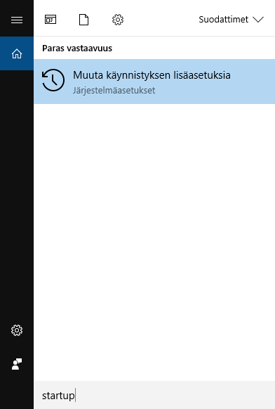
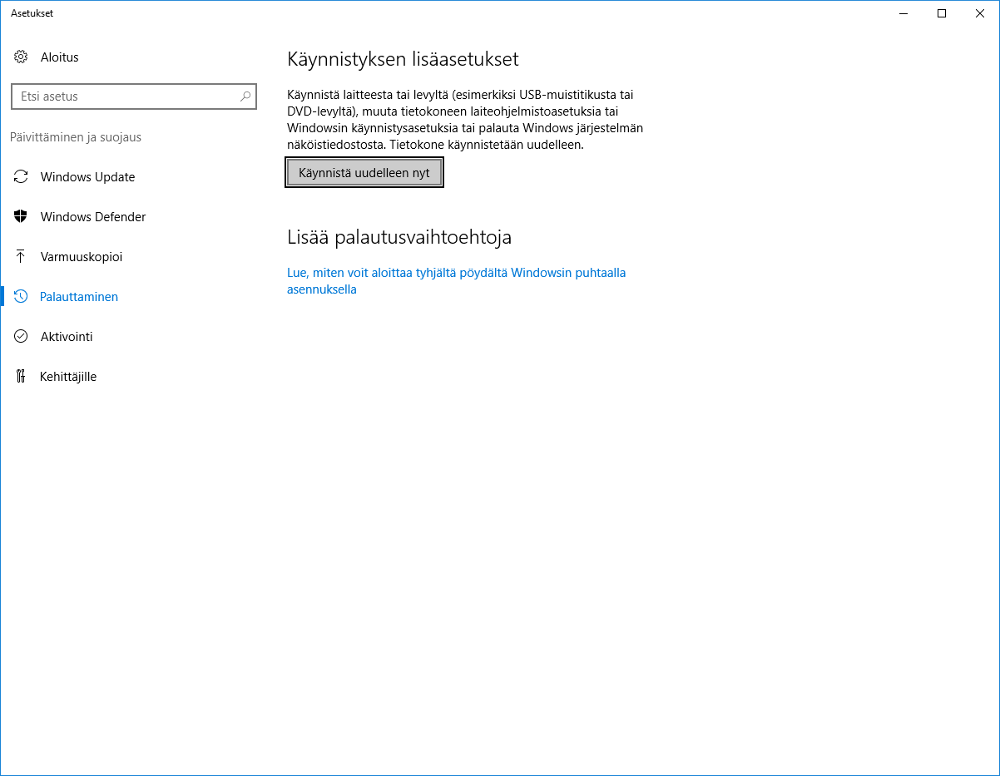
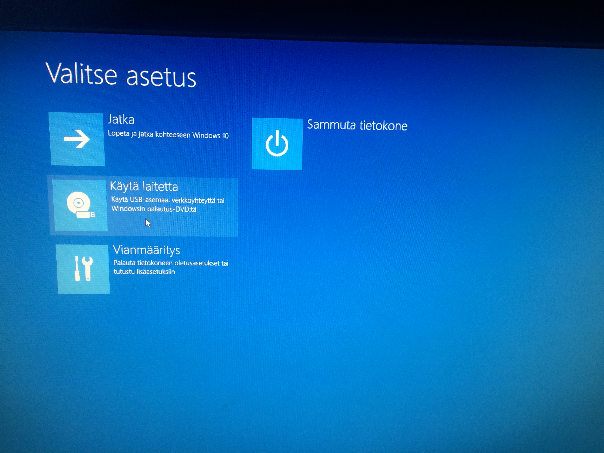

# Linuxin keskitetty hallinta

## Läksy 3:

Tehtävänanto löytyi [opettajan sivuilta](http://terokarvinen.com/2017/aikataulu-%E2%80%93-linuxin-keskitetty-hallinta-%E2%80%93-ict4tn011-11-%E2%80%93-loppukevat-2017-p2#comment-22379).

Käytin tehtävän tekemiseen Live-USB muistitikkua, joten aloitin ihan alkutekijöistä. Käyttämäni tietokoneen Biosiin oli laitettu asetukseksi Ultra Fast Boot, jolloin en pääse Boot menu -valikkoon mitenkään, vaan käyttöjärjestelmä Windows 10 latautui valmiiksi. Kirjoitin hakutoimintoon "startup", jolla löysin valikon, josta löytyi muistitikulta käynnistys. Eli latasin Windows 10 puolelta suoraan käyttöjärjestelmän USB-tikulta.

Linuxin käynnistyttyä, suoritin peruskomennot:

    $ setxkbmap fi
    $ uname -a
    Linux xubuntu 4.4.0-31-generic #50-Ubuntu SMP Wed Jul 13 00:07:12 UTC 2016 x86_64 x86_64 x86_64 GNU/Linux
    
    $ lsb_release -a
    No LSB modules are available.
    Distributor ID:	Ubuntu
    Description:	Ubuntu 16.04.1 LTS
    Release:	16.04
    Codename:	xenial

Yllä olevilla komennoilla selvitin koneen perustiedot ja alla olevilla komennoilla latasin tätä tehtävää varten tarvittavia ohjelmia.

    $ sudo apt-get update
    $ sudo apt-get install tree
    $ sudo apt-get install curl
    $ sudo apt-get install puppet
    $ sudo apt-get install git

Halusin käyttää jo aikaisemmin perustamaani Git -projektia, joten kloonasin sen paikalliselle koneelle käskyllä:

    $ git clone https://github.com/jkmala/linuxcourse

Perustin kansion tätä kotitehtävää varten komennolla:

    $ mkdir sshd
    
Lisäksi perustin tämän raportointisivun komennolla:

    $ nano sshd/homework3.md
    
Tässä vaiheessa kertasin itselleni, miten SSHD asennetaan koneelle käsin. Asensin sen, tarkistin kansion /etc/ssh/ ja sieltä löysin tiedoston sshd_config, jolla pystyy määrittelemään SSH daemonin käyttämän portin. Tein siitä template -tiedoston Puppetille komennoilla:
    
    $ mkdir -p ~/linuxcourse/sshd/modules/juhasshd/templates
    $ cp sshd_config ~/linuxcourse/sshd/modules/juhasshd/templates/sshd_config.erb

Parametri -p mkdir -komennossa tarkoittaa, että kaikki polkua varten tarvittavat kansiot perustetaan myös.
Tässä vaiheessa kävin muokkaamassa templates -kansiosta löytyvää sshd_config.erb tiedostoa riviltä, jossa luki "Port 22" muotoon "Port 52222". Ei varmaan ollut tarpeellista, mutta poistin myös juuri asentamani SSHD-daemonin koneeltani komennolla:

    $ sudo apt-get purge ssh
    
Seuraavaksi kirjoitin manifestin [Tero Karvisen sivuilta](http://terokarvinen.com/2013/ssh-server-puppet-module-for-ubuntu-12-04) löytyvän ohjeen avulla.

    $ mkdir -p /modules/juhasshd/manifests
    $ nano modules/juhasshd/manifests/init.pp

Init.pp -tiedoston sisällöksi kopioin Karvisen tekemän esimerkin omilla muokkaukselle (allowcdrom, koska liveUsb:

    class juhasshd {
        package { 'ssh':
                ensure => 'installed',
			allowcdrom => 'true',
        }

        file { '/etc/ssh/sshd_config':
                content => template(“juhasshd/sshd_config”),
                require => Package['ssh'],
                notify => Service['ssh'],
        }

        service {'ssh':
                ensure => 'running',
                enable => 'true',
                require => Package['ssh'],
        }
    }

Tree -komento antoi
    
    $ tree
    .
    ├── homework3.md
    └── modules
        └── juhasshd
            ├── manifests
            │   └── init.pp
            └── templates
                └── sshd_config.erb

Tässä vaiheessa halusin kokeilla Puppetin ajoa komennolla:

    $ puppet apply --modulepath modules/ -e 'class {"juhasshd":}'
    Error: Could not match “juhasshd/sshd_config.erb”), at /home/xubuntu/linuxcourse/sshd/modules/juhasshd/manifests/init.pp:8 on node xubuntu.elisa
    Error: Could not match “juhasshd/sshd_config.erb”), at /home/xubuntu/linuxcourse/sshd/modules/juhasshd/manifests/init.pp:8 on node xubuntu.elisa

Tarviko tähän sudoa?

    sudo puppet apply --modulepath modules/ -e 'class {"juhasshd":}'
    Error: Could not match “juhasshd/sshd_config.erb”), at /home/xubuntu/linuxcourse/sshd/modules/juhasshd/manifests/init.pp:8 on node xubuntu.elisa
    Error: Could not match “juhasshd/sshd_config.erb”), at /home/xubuntu/linuxcourse/sshd/modules/juhasshd/manifests/init.pp:8 on node xubuntu.elisa
    
Ei auttanut, muokkasin virheen aiheuttaman template -rivin (rivi 8) pois init.pp tiedostosta ja ajoin uudelleen komennon:

    xubuntu@xubuntu:~/linuxcourse/sshd$ sudo puppet apply --modulepath modules/ -e 'class {"juhasshd":}'
    Notice: Compiled catalog for xubuntu.elisa in environment production in 0.36 seconds
    Notice: /Stage[main]/Juhasshd/Package[ssh]/ensure: ensure changed 'purged' to 'present'
    Notice: Finished catalog run in 1.95 seconds
Ainakin lähti toimimaan ja käytän komentoa service sshd status -todistaakseni että ssh-daemon on päällä portissa 22. Template tiedostoni pitäisi muuttaa portin nimenomaan joksikin toiseksi, kuin 22.

    xubuntu@xubuntu:~/linuxcourse/sshd$ service sshd status
    ● ssh.service - OpenBSD Secure Shell server
     Loaded: loaded (/lib/systemd/system/ssh.service; enabled; vendor preset: enabled)
     Active: active (running) since Mon 2017-04-17 18:46:40 UTC; 1h 25min ago
    Main PID: 12155 (sshd)
     CGroup: /system.slice/ssh.service
             └─12155 /usr/sbin/sshd -D

    Apr 17 18:46:40 xubuntu systemd[1]: Starting OpenBSD Secure Shell server...
    Apr 17 18:46:40 xubuntu sshd[12155]: Server listening on 0.0.0.0 port 22.
    Apr 17 18:46:40 xubuntu sshd[12155]: Server listening on :: port 22.
    Apr 17 18:46:40 xubuntu systemd[1]: Started OpenBSD Secure Shell server.

Siis menin muokkaamaan taas init.pp tiedostoa ja lisään sinne aikaisemmin poistamani rivin. Tällä kertaa kirjoitan sen itse käsin, jonka jälkeen se näyttää tältä:

    class juhasshd {
        package { 'ssh':
                ensure => 'installed',
		allowcdrom => 'true',
        }

        file { '/etc/ssh/sshd_config':
		content => template('juhasshd/sshd_config.erb'),
                require => Package['ssh'],
                notify => Service['ssh'],
        }

        service {'ssh':
                ensure => 'running',
                enable => 'true',
                require => Package['ssh'],
        }
    }

Mielestäni se näyttää ihan samalta, kuin aiemmin, mutta vaihdan lainausmerkit(") hipsuun('). Ajan Puppetin uudelleen ja tarkistan ssh-daemonin portin:

    xubuntu@xubuntu:~/linuxcourse/sshd$ sudo puppet apply --modulepath modules/ -e 'class {"juhasshd":}'
    Notice: Compiled catalog for xubuntu.elisa in environment production in 0.37 seconds
    Notice: /Stage[main]/Juhasshd/File[/etc/ssh/sshd_config]/content: content changed '{md5}bd3a2b95f8b4b180eed707794ad81e4d' to '{md5}13f1e619e91b82c8e80c01e12462b3f3'
    Notice: /Stage[main]/Juhasshd/Service[ssh]: Triggered 'refresh' from 1 events
    Notice: Finished catalog run in 0.12 seconds
    xubuntu@xubuntu:~/linuxcourse/sshd$ service sshd status
    ● ssh.service - OpenBSD Secure Shell server
       Loaded: loaded (/lib/systemd/system/ssh.service; enabled; vendor preset: enabled)
       Active: active (running) since Mon 2017-04-17 20:15:27 UTC; 24s ago
     Main PID: 13649 (sshd)
       CGroup: /system.slice/ssh.service
               └─13649 /usr/sbin/sshd -D

    Apr 17 20:15:27 xubuntu systemd[1]: Starting OpenBSD Secure Shell server...
    Apr 17 20:15:27 xubuntu sshd[13649]: Server listening on 0.0.0.0 port 52222.
    Apr 17 20:15:27 xubuntu sshd[13649]: Server listening on :: port 52222.
    Apr 17 20:15:27 xubuntu systemd[1]: Started OpenBSD Secure Shell server.
    
Kuten statuksesta näkyy, moduli toimi ja portti on muutettu nyt 52222. 

B) Yritän löytää tietoa ja esimerkkejä, mikä olisi paras keino siirtää Gitistä modulit suoraan uuteen koneeseen. Luulen, että ensin pitäisi asentaa Git ja Puppet. Sitten voisi ensin kloonata gitistä puppet modulin omassa kansiossaan paikalliseen koneeseen ja sitten ajaa puppetin moduli. Joten käynnistän koneen uudelleen LiveUsb-tikulta ja kokeilen seuraavia komentoja:
 
    1  setxkbmap fi
    2  sudo apt-get update
    3  sudo apt-get install -y git
    4  sudo apt-get install -y puppet
    5  git clone https://github.com/jkmala/linuxcourse
    6  sudo puppet apply --modulepath linuxcourse/modules/ -e 'class {"apassi":}'

Tässä vaiheessa voin todeta, että tähän ei mennyt kovinkaan kauan aikaa, noin minuutti kaikkien yllä olevien käskyjen kirjoittamiseen. Toki turhan monimutkaista ja luulen, että tähän on keksitty suoraviivaisempi keino, esimerkiksi librarian-puppet vaikutti juuri tähän ongelmaan keksityltä ohjelmalta.

C) B-tehtävässä annetut komennot ajavat puppet modulin, jonka tein luokassa viime tunnilla tuntitehtävänä. Apache2 -webpalvelimelle säädettiin omat asetukset, joissa yhtenä oli tehtävänannossa pyydetty oletussivun muokkaus. Ohjeita löysin tähän tehtävään taas [opettajan sivuilta](http://terokarvinen.com/2016/new-default-website-with-apache2-show-your-homepage-at-top-of-example-com-no-tilde). Tässä apassi-moduleni init.pp-tiedosto manifests-kansiosta:

    class apassi {
	
	package {'apache2':
		ensure => 'installed',
		allowcdrom => 'true',
	}
	
	file {'/home/xubuntu/publicwebsite':
		ensure => 'directory',
		owner => 'xubuntu',
		group => 'xubuntu',
	}
	
	file {'/home/xubuntu/publicwebsite/index.html':
		content => "New life for Apache2!",
		owner => 'xubuntu',
		group => 'xubuntu',
	}
	
	file {'/var/www/html/index.html':
		content => "Welcome to default page of Apache2 web server!",
		notify => Service['apache2'],
	}

	file {'/etc/apache2/sites-available/xubuntu.conf':
		content => template("apassi/xubuntu.conf.erb"),
		require => Package['apache2'],
		notify => Service['apache2'],
	}
	
	file {'/etc/apache2/sites-enabled/xubuntu.conf':
		ensure => 'link',
		target => '/etc/apache2/sites-available/xubuntu.conf'
		#require => File['/etc/apache2/sites-available/xubuntu.conf'],
				
	}
	
	file {'/etc/apache2/sites-enabled/000-default.conf':
		ensure => 'absent',
		notify => Service['apache2'],
	}
	
	service {'apache2':
		ensure => 'running',
		enable => 'true',
		require => Package["apache2"],
	}	
    }

    xubuntu@xubuntu:~/linuxcourse/modules$ tree 
    .
    └── apassi
        ├── manifests
        │   └── init.pp
        └── templates
            └── xubuntu.conf.erb

    3 directories, 2 files

Tuosta init.pp tiedostosta voisi ottaa useamman file kohdan pois ja silti saavuttaisi tehtävänannossa pyydetyn toiminnontason.
Kirjoitan Firefoxin osoiteriville "localhost" ja voin todeta default sivun vaihtuneen:

